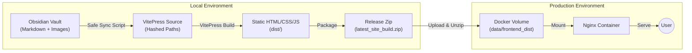

# Obsidian2VitePress

[](https://vitepress.dev/)
[](https://obsidian.md/)
[](https://www.docker.com/)
[](LICENSE)

> **极简、高效、健壮的个人知识库系统。**
> 
> 这是一个基于 [VitePress](https://vitepress.dev/) 构建的静态博客系统，专门为 **Obsidian** 用户打造的"发布流"解决方案。你只需要专注于在 Obsidian 中写作，剩下的同步、清洗、构建、打包全部由自动化脚本完成。

## 🌟 核心特性 (Features)

### 🛡️ 健壮的同步流 (Robust Sync)
*   **安全路径处理 (Safe Paths)**: 针对 Windows 系统优化，自动将中文文件名转换为安全的 MD5 哈希路径（如 `d3a1b2.md`），彻底解决构建时的乱码和路径查找失败问题。
*   **智能内容清洗 (Auto Sanitization)**: 自动识别并转义技术文档中常见的冲突语法（如 `<path>`, `<font>`, Vue 插值 `{{ }}`），防止它们被编译器误读导致构建崩溃。
*   **构建保障 (Build Safety)**: 智能识别非图片资源（如 `.zip`, `.gz`），自动以文本链接形式回退，确保即使包含特殊附件也不会打断整个网站的生成。

### 📖 核心理念 (Concepts)
1.  **数据源即真理 (Source of Truth)**: 你的 Obsidian Vault 是唯一的内容源。
2.  **零侵入写作**: 不需要学习复杂的 Frontmatter 配置，像平常一样写笔记即可。
3.  **自动化工作流**: 一键脚本完成 `同步 -> 清洗 -> 转换 -> 构建 -> 打包` 全过程。
4.  **无后端架构**: 生成纯静态 HTML，部署简单，安全性高，访问速度极快。

## 🏗️ 架构概览 (Architecture)



## 📂 目录结构

```text
.
├── obsidian2vitepress/
│   ├── site/               # VitePress 前端项目源码
│   │   ├── docs/           # (自动生成) 同步后的文档存放处，每次发布会自动清空重写
│   │   └── .vitepress/     # 站点配置文件 (config.mjs, theme config)
│   ├── scripts/sync.js     # 核心同步脚本：处理哈希映射、内容清洗、资源转换
│   └── deploy/             # 部署配置
│       └── docker-compose.yml # 生产环境 Docker 编排文件
├── vault/                  # 你的个人知识库
│   └── publish/            # 【重要】只有放入此目录的笔记才会被发布
├── publish.ps1             # Windows 一键发布脚本
├── publish.sh              # macOS/Linux 一键发布脚本
└── README.md
```

## 🚀 快速开始 (Quick Start)

### 1. 初始化项目

```bash
# 1. 克隆仓库
git clone https://github.com/your-username/your-repo.git
cd your-repo

# 2. 安装依赖
cd obsidian2vitepress/site
npm install
```

### 2. 本地开发预览
在写作过程中，你可以实时预览网站效果：

```bash
npm run docs:dev
```
访问 `http://localhost:5173`。

## ✍️ 写作指南 (Writing Guide)

1.  **准备内容**: 在 `vault/publish` 文件夹下创建你的笔记目录结构。此结构会自动转化为网站的**左侧导航栏**。
2.  **引用图片**: 直接拖入 Obsidian，支持标准语法 `![[图片.png]]` 或 markdown 语法 ``。脚本会自动处理复制。
3.  **特殊附件**: 如果你引用了 `.zip` 或 `.gz` 等文件，脚本会在发布时自动将其转换为 `(Attachment: filename)` 文本，避免构建错误。
4.  **代码片段**: 放心书写你的 Go Template 或包含 HTML 标签的代码，脚本会自动转义，你在网页上看到的将是它们原本的样子。

## 📦 发布与部署 (Deployment)

我们提供了一键脚本来简化发布流程。脚本会执行：**全量清理 -> 安全同步 -> 静态构建 -> 容错打包**。

### Windows 用户
在项目根目录运行 PowerShell：
```powershell
./publish.ps1
```

### macOS / Linux 用户
在项目根目录运行 Bash：
```bash
chmod +x publish.sh # 首次运行赋权
./publish.sh
```

### 部署到服务器 (Docker)

脚本运行结束后，会在根目录生成 `latest_site_build.zip`（约 100KB+，包含完整静态资源）。

1.  **启动服务**:
    ```bash
    cd obsidian2vitepress/deploy
    docker-compose up -d
    ```
2.  **部署内容**:
    将 `latest_site_build.zip` 上传到服务器并解压。
    **注意：** 压缩包内已经是网站的最终静态文件（HTML/CSS/JS），直接将其解压到 Docker 容器挂载的持久化目录即可（例如 Nginx 的 html 目录）。

    *示例操作*:
    ```bash
    # 假设你挂载的宿主机目录是 ./dist
    unzip -o latest_site_build.zip -d ./dist
    ```
    无需重启 Nginx，刷新浏览器即可生效。

## ⚙️ 高级配置 (Configuration)

### 修改站点信息
编辑 `obsidian2vitepress/site/docs/.vitepress/config.mjs` 修改标题和描述。

### 同步逻辑
核心逻辑位于 `obsidian2vitepress/scripts/sync.js`。该文件包含了文件名哈希映射、内容清洗正则等核心算法。

## 📄 License

Let’s fucking free!
